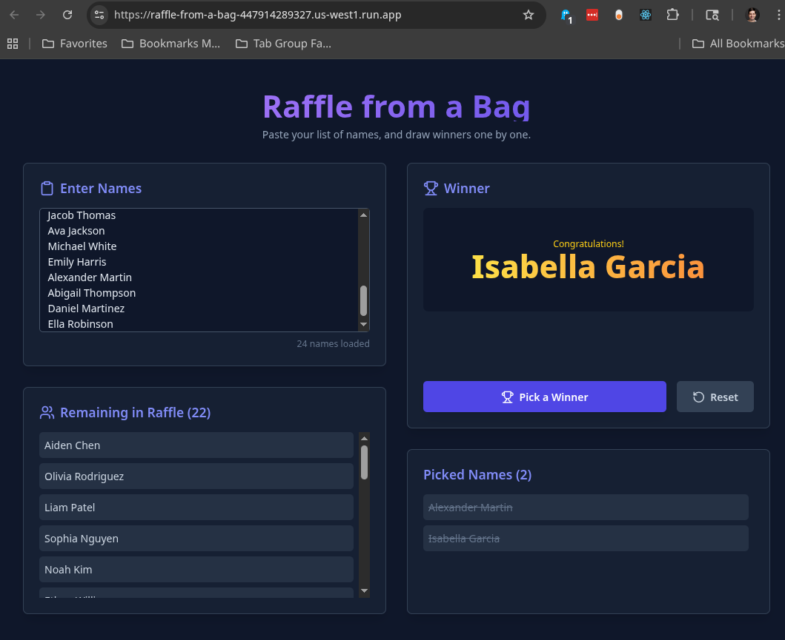

# First Vibe Coding agent for a Raffle app

For DevFets Fresno 2025. Prompt was "A web page which can conduct raffles from a bag of names. There's an input which takes a multi line of names from the clipboard. We need a button which randomly picks one of the names and then removes it from the list. A reset button would restore the list to its original full extent."

Came out pretty neat:

Has counter for both the unraffled and the raffled names. It also does a nice raffle animation, even though there's no confetti at the end.
The default README follows:

# The Default README

# Run and deploy your AI Studio app

This contains everything you need to run your app locally.

View your app in AI Studio: https://ai.studio/apps/drive/1v35ZYFy0ybvIvcZi4JOFdZ9et5-xYCwt

## Run Locally

**Prerequisites:**  Node.js

1. Install dependencies:
   `npm install`
2. Set the `GEMINI_API_KEY` in [.env.local](.env.local) to your Gemini API key
3. Run the app:
   `npm run dev`
